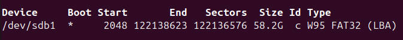

# whyred刷入postmarketOS

> postmarketOS对whyred的支持是非正式的，由社区个人发布，最近一次发布为2018年，请参照词条[Xiaomi Redmi Note 5 Pro (xiaomi-whyred)](https://wiki.postmarketos.org/wiki/Xiaomi_Redmi_Note_5_Pro_(xiaomi-whyred))

## 准备工作

- 一台刷了TWRP的Redmi-Note5
- 一台可运行Linux虚拟机的Windows设备或Linux物理机
- 一张闲置tf卡(构建镜像过程会格式化tf卡)
- (可选)一张sd卡适配器(假如你的电脑不支持直接插入tf卡的话)

> 本例将使用Ubuntu

## (可选步骤)Linux虚拟机

### 安装虚拟机

假如你是Windows用户，请自行搜索安装VMware workstation并创建任意Linux发行版的虚拟机。
假如你有Linux物理机，直接跳到第二章安装依赖。

### 挂载sdcard

虚拟机用户请参考[这篇文章](https://blog.csdn.net/juan190755422/article/details/103851864#:~:text=%E6%89%93%E5%BC%80Ubuntu%E8%99%9A%E6%8B%9F%E6%9C%BA%E7%9A%84%E8%AE%BE%E7%BD%AE%EF%BC%8C%E9%80%89%E6%8B%A9%E6%B7%BB%E5%8A%A0%EF%BC%8C%E9%80%89%E6%8B%A9%E7%A1%AC%E7%9B%98%EF%BC%8C%E4%B8%8B%E4%B8%80%E6%AD%A5%EF%BC%8C%E5%A6%82%E5%9B%BE%EF%BC%9A%20%E4%BF%9D%E6%8C%81%E9%BB%98%E8%AE%A4%EF%BC%8C%E4%B8%8B%E4%B8%80%E6%AD%A5%EF%BC%8C%E5%A6%82%E5%9B%BE%EF%BC%9A%20%E9%80%89%E6%8B%A9%E7%89%A9%E7%90%86%E7%A3%81%E7%9B%98%EF%BC%8C%E4%B8%8B%E4%B8%80%E6%AD%A5%EF%BC%8C%E5%A6%82%E5%9B%BE%EF%BC%9A%20%E9%80%89%E6%8B%A9%20physicalDrive%201%EF%BC%88%E8%8B%A5%E4%B8%8D%E7%A1%AE%E5%AE%9A%EF%BC%8C%E8%AF%B7%E5%BC%B9%E5%87%BASD%E5%8D%A1%EF%BC%8CphysicalDrive,1%E6%B6%88%E5%A4%B1%EF%BC%8C%E5%88%99%E8%AF%B4%E6%98%8EphysicalDrive%201%E6%98%AFSD%E5%8D%A1%EF%BC%8C%E8%BF%99%E4%B8%80%E6%AD%A5%E4%B8%80%E5%AE%9A%E8%A6%81%E7%A1%AE%E8%AE%A4%E5%A5%BD%EF%BC%8CphysicalDrive%200%E6%98%AF%E7%AC%94%E8%AE%B0%E6%9C%AC%E7%A1%AC%E7%9B%98%EF%BC%8C%E8%AF%AF%E6%93%8D%E4%BD%9C%E5%8F%AF%E8%83%BD%E5%AF%BC%E8%87%B4%E7%A1%AC%E7%9B%98%E6%95%B0%E6%8D%AE%E4%B8%A2%E5%A4%B1%E3%80%82%20%EF%BC%89%EF%BC%8C%E4%BD%BF%E7%94%A8%E6%95%B4%E4%B8%AA%E7%A3%81%E7%9B%98%EF%BC%8C%E4%B8%8B%E4%B8%80%E6%AD%A5%EF%BC%8C%E5%A6%82%E5%9B%BE%EF%BC%9A%20%E8%AE%BE%E7%BD%AE%E7%A1%AC%E7%9B%98%E6%96%87%E4%BB%B6%E7%9A%84%E4%BF%9D%E5%AD%98%E4%BD%8D%E7%BD%AE%EF%BC%8C%E5%AE%8C%E6%88%90%EF%BC%8C%E7%A1%AE%E5%AE%9A%EF%BC%8C%E5%A6%82%E5%9B%BE%EF%BC%9A%20%E8%8B%A5%E5%87%BA%E7%8E%B0%E4%B8%8B%E9%9D%A2%E7%9A%84%E9%94%99%E8%AF%AF%E6%8F%90%E7%A4%BA%EF%BC%8C%E8%AF%B7%E4%BB%A5%E7%AE%A1%E7%90%86%E5%91%98%E7%9A%84%E8%BA%AB%E4%BB%BD%E6%89%93%E5%BC%80VMWare%E8%99%9A%E6%8B%9F%E6%9C%BA%E8%BD%AF%E4%BB%B6%EF%BC%8C%E6%8C%89%E7%85%A7%E4%B8%8A%E8%BF%B0%E6%AD%A5%E9%AA%A4%E9%87%8D%E6%96%B0%E8%B5%B0%E4%B8%80%E9%81%8D%E5%8D%B3%E5%8F%AF%E3%80%82%20%E8%AE%BE%E7%BD%AE%E5%AE%8C%E6%88%90%E5%90%8E%EF%BC%8C%E8%8B%A5Ubuntu%E8%99%9A%E6%8B%9F%E6%9C%BA%E6%97%B6%E5%BC%80%E6%9C%BA%E7%8A%B6%E6%80%81%EF%BC%8C%E8%AF%B7%E9%87%8D%E6%96%B0%E5%90%AF%E5%8A%A8Ubuntu%E7%B3%BB%E7%BB%9F%E3%80%82)将你的tf卡挂载到linux虚拟机上

## 安装依赖

postmarketOS的刷机镜像是需要自行构建的，社区提供了专用的构建工具，配置并运行构建工具需要安装`git`和`python3`

```bash
sudo apt update && sudo apt install git python3 -y
```

## 安装构建工具`pmbootstrap`

上一章提及的构建工具叫做`pmbootstrap`，本章介绍如何安装该工具。

> 以下步骤需要终端自始至终停留在同一路径

1. 打开终端，在你的linux环境中选定一个地方(随便点就桌面)把构建工具的项目文件拷下来

```bash
git clone --depth=1 https://gitlab.com/postmarketOS/pmbootstrap.git
```

2. 创建symbolic link

```bash
mkdir -p ~/.local/bin && ln -s "$PWD/pmbootstrap/pmbootstrap.py" ~/.local/bin/pmbootstrap
```

3. 检查一下指令是否配置成功了

```bash
pmbootstrap --version
```

4. 假如显示未找到指令则再执行

```bash
echo 'export PATH="$HOME/.local/bin:$PATH"' >> ~/.bashrc && source ~/.bashrc
```

再重复一遍第3步，输出版本号则成功。

## 构建镜像

### 创建构建配置

这一步是为了配置你要构建的镜像，执行下列指令，进入引导程序。

```bash
pmbootstrap init
```

配置项有很多，这里只列举最重要的，其余的请自行翻译理解。

1. channel选择edge，只有edge才包含对whyred

### 查看tf卡的挂载点

插入你的tf卡，使用`fdisk`查看挂载点

```bash
sudo fdisk -l
```

如何判断那个是你的tf卡？一看Size，你的卡有多大；二看Type，你的tf卡的文件系统格式是什么；三看前后对比，把你卡拔了再看哪个消失了就是你的卡。下图是linux虚拟机把sdcard作为硬盘挂载的结果，纯正linux用户结果可能不同。此时我们要的挂载点就是`/dev/sdb1`，下一小节将使用这个挂载点向tf卡中安装镜像。



### 安装镜像

执行以下指令则开始安装镜像至tf卡，注意把`/dev/sdb1`替换成你实际的tf卡挂载点。

```bash
pmbootstrap install --sdcard=/dev/sdb1
```
