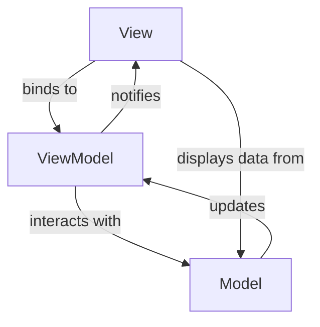

# Introduction

This chapter introduces the common usage of MVVM pattern with `CommunityToolkit.Mvvm`.

## Model

Model is basically a data shape, it describes the entity.
A model should pure with a bunch of properties only.(May include implicit conversion operators.)

## ViewModel

ViewModel is the mediator for Model and View.

Isolates the two, making View completely ignorant to Model.(Model surely don't know about View, it's just a pure shape)

It represents the status of a Model instance as a Observable with extra logic for creating or manipulating itself.

## View

- defining properties to store necessary data for displaying on UI.
- defining commands to be triggered when interacting with users.
- every data type represented as observable should be a ViewModel.
