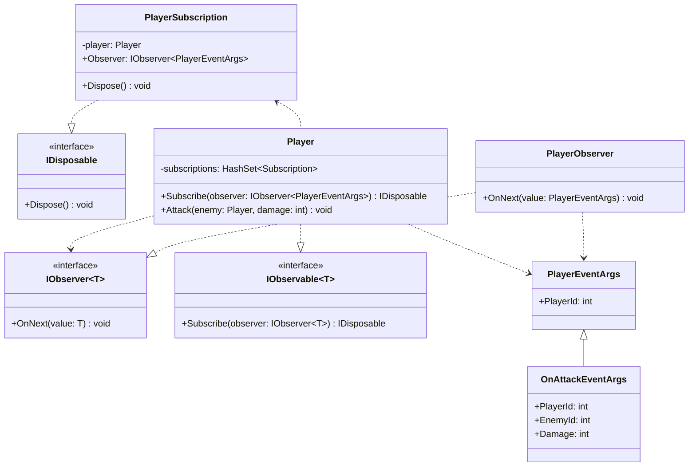

# Observer

## Motivation

- To be informed when status changed
- To be informed when certain things happened.
- Listen to events and get notified when they occurs

.NET has following builtin types to perform observer pattern.

- `INotifyPropertyChanged`
- `INotifyPropertyChanging`
- `IObservable<T>`
- `IObserver<T>`
- `ObervableCollection<T>`
- `BindingList<T>`

> [!NOTE]
> Observer is the object to be informed when event occurs, informed by passing event args.
> Observable is the object passes the event args when performing something.

## Builtin Event

C# has builtin event support. Use `+=` to subscribe a method.

> [!NOTE]
> Event handler is the Observer
> `Player` is the Observable

```cs
Player player = new() { Id = 1 };
Player enemy = new() { Id = 2 };

player.OnHurt += (object? sender, PlayerOnHurtArgs args) => // event handler method is the Observer// [!code highlight] 
    Console.WriteLine($"Player {(sender as Player)?.Id ?? -1} get hurt by damage {args.Damage} from player {args.Id}"); // [!code highlight] 

player.GetHurt(1, enemy);

class Player
{
    public int Id { get; init; }
    public int Health { get; private set; } = 100;
    public event EventHandler<PlayerOnHurtArgs>? OnHurt;
    public void GetHurt(int damage, Player another)
    {
        Health -= damage;
        OnHurt?.Invoke(this, new(damage, another.Id)); // [!code highlight] 
    }
}

record PlayerOnHurtArgs(int Damage, int Id);
```

## Weak Event

When a method of an instance was added to an event, the containing object of the method will never be collected by GC.

```cs
Player player = new() { Id = 1 };
Player? enemy = new() { Id = 2 };

player.OnHurt += enemy.OnHurtHandler; // subscribes a handler from another instance // [!code highlight] 
WeakReference<Player> enemyRef = new(enemy);
enemy = null;
GC.Collect(); // should enemy be collected? // [!code highlight] 
Console.WriteLine($"enemy is {(enemyRef.TryGetTarget(out _) ? "alive" : "collected")}"); // <- enemy is alive // [!code highlight] 

class Player
{
    public int Id { get; init; }
    public int Health { get; private set; } = 100;
    public event EventHandler<PlayerOnHurtArgs>? OnHurt;
    public void GetHurt(int damage, Player enemy)
    {
        Health -= damage;
        OnHurt?.Invoke(this, new(damage, enemy.Id));
    }
    public void OnHurtHandler(object? sender, PlayerOnHurtArgs args) // [!code ++] 
    { // [!code ++] 
        Console.WriteLine($"Player {(sender as Player)?.Id ?? -1} get hurt by damage {args.Damage} from player {args.Id}"); // [!code ++] 
    } // [!code ++] 
}

record PlayerOnHurtArgs(int Damage, int Id);
```

That's why weak event pattern matters.
```cs
Player player = new() { Id = 1 };
Player? enemy = new() { Id = 2 };

player.OnHurt += enemy.OnHurtHandler; // subscribes a handler from another instance // [!code --] 
WeakEventManager<Player, PlayerOnHurtArgs>.AddHandler(player. "OnHurt", enemy.OnHurtHandler) // [!code ++] 
WeakReference<Player> enemyRef = new(enemy);
enemy = null;
GC.Collect(); // should enemy be collected? // [!code highlight] 
Console.WriteLine($"enemy is {(enemyRef.TryGetTarget(out _) ? "alive" : "collected")}"); // <- enemy is collected // [!code highlight] 

class Player
{
    public int Id { get; init; }
    public int Health { get; private set; } = 100;
    public event EventHandler<PlayerOnHurtArgs>? OnHurt;
    public void GetHurt(int damage, Player enemy)
    {
        Health -= damage;
        OnHurt?.Invoke(this, new(damage, enemy.Id));
    }
    public void OnHurtHandler(object? sender, PlayerOnHurtArgs args) // [!code ++] 
    { // [!code ++] 
        Console.WriteLine($"Player {(sender as Player)?.Id ?? -1} get hurt by damage {args.Damage} from player {args.Id}"); // [!code ++] 
    } // [!code ++] 
}

record PlayerOnHurtArgs(int Damage, int Id);
```
> [!WARNING]
> `WeakEventManager` is not available in .NET Core

## Observer and Observable

The major downside of event in C# is **event leak**, which happens when event handlers remain subscribed and prevent objects from being garbage collected, leading to memory leaks.

.NET has builtin types to implement the same event mechanism with `System.IObserver<T>` and `System.IObservable<T>`



**Observable and Observer do not know each other, the mediator is certain `EventArgs`. Observer handles notifications by different kinds of `EventArgs`.**

- Observable: adds Observers
    - Subscription: as a `IDisposable` pair of Observer and Observable, will be stored on a collection inside Observable.
        - `Dispose` acts like `-=`
    - `Subscribe` acts like `+=`
- Observer: independently handles different scenarios. `OnNext`, `OnError` .etc

```cs
Player player = new() { Id = 1 };
Player? enemy = new() { Id = 2 };
var subscriber = new PlayerObserver(); // [!code highlight] 
using var _ = player.Subscribe(subscriber); // [!code highlight] 
player.Attack(enemy, 100); // [!code highlight] 

class Player : IObservable<PlayerEventArgs>
{
    public int Id { get; init; }
    public int Health { get; private set; } = 100;
    private readonly HashSet<Subscription> subscriptions = []; // events as collections // [!code highlight] 

    // subscribes an event just like `+=` when using builtin event // [!code highlight] 
    public IDisposable Subscribe(IObserver<PlayerEventArgs> observer) // [!code highlight] 
    {
        var subscription = new Subscription(this, observer);
        subscriptions.Add(subscription);
        return subscription;
    }

    public void Attack(Player enemy, int damage)
    {
        // ...
        foreach (var sub in subscriptions)
        {
            sub.Observer.OnNext(new OnAttackEventArgs { EnemyId = enemy.Id, Damage = damage, PlayerId = Id });
        }
    }
    // a subscription should know which one is being subscribed and who is the observer. // [!code highlight] 
    // observer take a `PlayerEventArgs` which is a base EventArgs, allowing different type of subscription to be inside `subscriptions` // [!code highlight] 
    private class Subscription(Player player, IObserver<PlayerEventArgs> observer) : IDisposable // [!code highlight] 
    {
        private readonly Player player = player;
        public IObserver<PlayerEventArgs> Observer { get; } = observer;

        public void Dispose()
        {
            player.subscriptions.Remove(this);
        }
    }
}

class PlayerEventArgs
{
    public int PlayerId { get; set; }
}
class OnAttackEventArgs : PlayerEventArgs
{
    public int EnemyId { get; set; }
    public int Damage { get; set; }
}
class PlayerObserver : IObserver<PlayerEventArgs>
{
    public void OnCompleted() { }

    public void OnError(Exception error) { }

    public void OnNext(PlayerEventArgs value)
    {
        if (value is OnAttackEventArgs args)
        {
            Console.WriteLine($"Enemy id: {args.EnemyId} was attacked by player id: {args.PlayerId} with damage {args.Damage}");
        }
        // ...
    }
}
```
