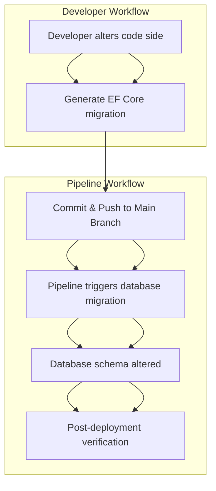

# Executing Migration

## Update migration

```sh
dotnet-ef database update [<migration_name>]
```

:::info
If `migration_name` is ignored, updates to the latest migration.
:::

## Migration check

A checking can be important if the migration hasn't been applied.

```cs
// Program.cs
var context = scope.ServiceProvider.GetRequiredService<MoviesContext>();
var pendingMigrations = await context.Database.GetPendingMigrationsAsync();
if (pendingMigrations.Any())
    throw new Exception("Database is not fully migrated for MoviesContext.");
```

## Generate migration script

```sh
dotnet ef migrations script <from_migration> <to_migration> > <filename>.sql
```

This command generates a SQL script of the migration(s) to be executed manually or through a database deployment pipeline. 

## Generate migration bundle

```sh
dotnet-ef migrations bundle
```

This command generates a self-contained executable to apply migrations, named as `efbundle` by default. Use `./efbundle --help` to see more options

## Migration workflow

A common approach of migration execution is using pipeline workflow.
Developers commit migrations, and then after passing the code review, the pipeline starts to apply changes to the database.


