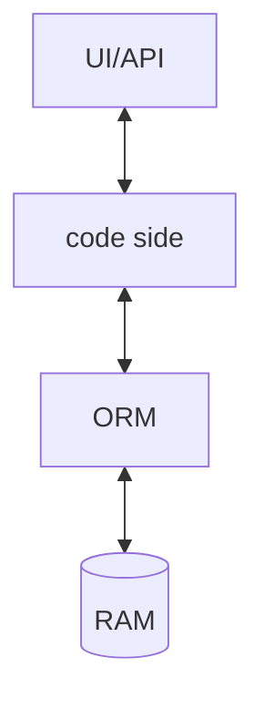

# Memory Database

Common practice of memory database is using SQLite or memory database inside EFCore(`InMemoryDB`).



## Pros & Cons

- Pros:
    - Faster since no database engine involved, reading from memory directly.

- Cons:
    - Certain features might be missing since you're not using the same database engine.
    - Data type missing or incompatible.
    - Incompatible SQL syntax when executing raw SQL.

## Practical usage

SQLite approach is always preferred as memory database, it has more features.

A custom ctor is required since we have to create the instance without DI.

```cs
class FooContext : Dbcontext
{
    public FooContext(DbcontextOptions<FooContext> options) : base(options) {}
}
```

```cs
using Microsoft.AspNetCore.Mvc;
using Microsoft.Data.Sqlite;
using Microsoft.EntityFrameworkCore;

public class SqlLiteTest : IDisposable
{
    private readonly SqliteConnection _connection;

    // Test setup
    public SqlLiteTest()
    {
        _connection = new SqliteConnection("Filename=:memory:");
        _connection.Open();

        var context = CreateMemoryContext(_connection);

        context.Database.EnsureCreated();

        context.Foos.AddRange([]); // add some sample data as you like

        context.SaveChanges();
    }

    private static FooContext CreateMemoryContext(SqliteConnection connection)
    {
        var contextOptions = new DbContextOptionsBuilder<FooContext>()
            .UseSqlite(connection)
            .Options;
        return new FooContext(contextOptions); // requires a ctor overload
    }

    public void Dispose()
    {
        _connection.Dispose();
        GC.SuppressFinalize(this);
    }

    [Fact]
    public async Task YourTest()
    {
        // Arrange
        var context = CreateMemoryContext(_connection);
        var controller = new FooController(context);

        // Act
        var response = await controller.Get(2);
        var okResult = response as OkObjectResult;

        // Assert
        Assert.NotNull(okResult);
        Assert.Equal(200, okResult.StatusCode);
    }
}
```
