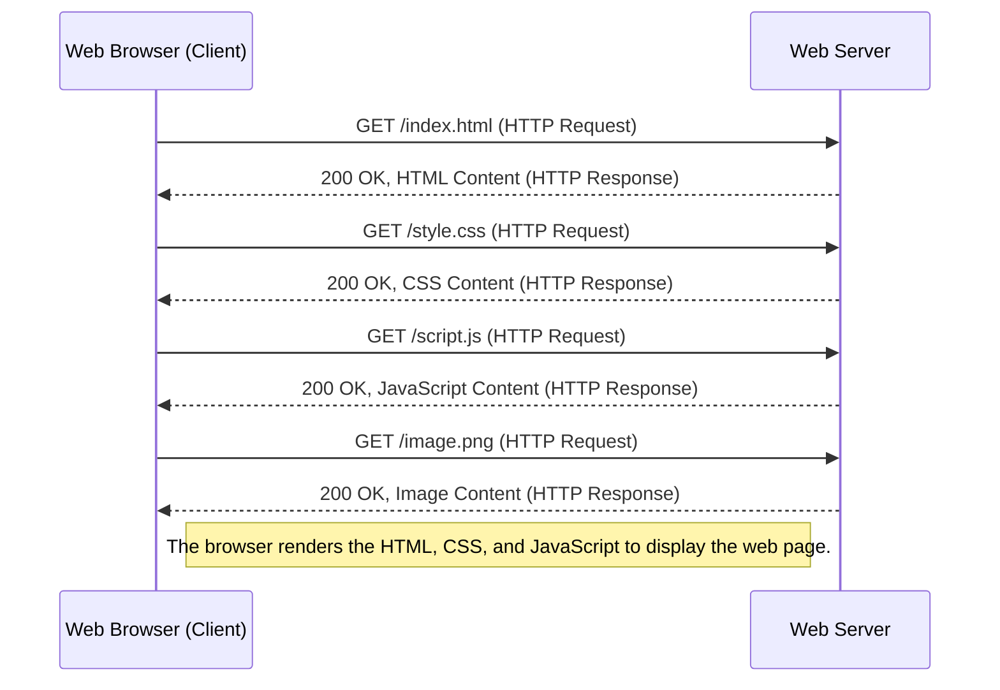

# How Web Works

## What's URL

Uniformed Resource Location(URL) is a reference or address used to access resources on the internet. 
It specifies the location of a resource and the protocol used to retrieve it, allowing web browsers and other clients to locate and interact with the resource.

```http
protocol://hostname:<port>/path?query#fragment
```

- protocol: can be `http`, `https`, `ftp` etc.
- port: `80` for `http` by defualt and `443` for `https`.

## What's HTTP

Hypertext Transfer Protocol(HTTP) is a language used for communicating through internet.

- Methods
    - `PUT`
    - `GET`
    - `POST`
    - `DELETE`
- Status Codes: indicating the result of request.

### HTTPS

Hypertext Transfer Protocol with Encryption(HTTPS) encrypts messages between clients and server.

### HTTP as a language

- Request example

```http
GET /index.html HTTP/1.1
Host: www.example.com
User-Agent: Mozilla/5.0 (Windows NT 10.0; Win64; x64) AppleWebKit/537.36 (KHTML, like Gecko) Chrome/91.0.4472.124 Safari/537.36
Accept: text/html,application/xhtml+xml,application/xml;q=0.9,image/avif,image/webp,image/apng,*/*;q=0.8
Accept-Language: en-US,en;q=0.5
Accept-Encoding: gzip, deflate, br
Connection: keep-alive
Upgrade-Insecure-Requests: 1
```

- Response example

```http
HTTP/1.1 200 OK
Date: Sun, 22 Sep 2024 10:30:00 GMT
Server: Apache/2.4.41 (Ubuntu)
Last-Modified: Tue, 15 Jun 2024 14:00:00 GMT
Content-Type: text/html
Content-Length: 3421
Connection: keep-alive

<html>
  <head>
    <title>Example Page</title>
  </head>
  <body>
    <h1>Welcome to Example.com!</h1>
    <p>This is a sample web page.</p>
  </body>
</html>
```

## DOM

The Document Object Model (DOM) is a programming interface for web documents. 
It represents the structure of a web page as a tree of objects, where each node in the tree corresponds to a part of the document, 
such as an element, attribute, or text content. 
The DOM allows scripts (usually JavaScript) to dynamically access and manipulate the content, structure, and style of web pages.


