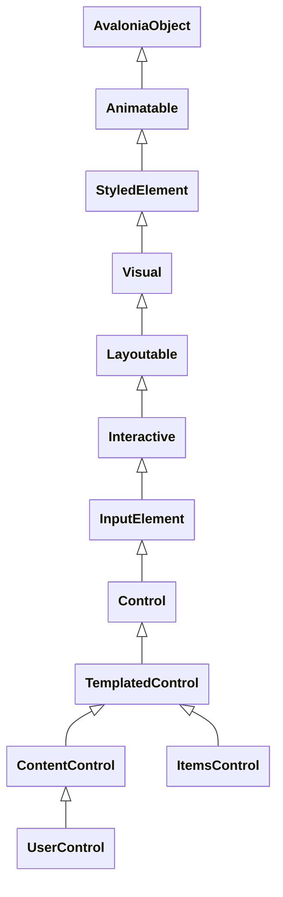

# Avalonia Types

One should know about avalonia types before learning XAML, each tag in XAML constructs a instance from corresponding type.
XAML also has some implicit bindings for special types with certain properties, such as `ContentControl.Content` and `ItemsControl.Items`.
There's two critical base classes in avalonia：
- `AvaloniaObject`: a type containing a bunch of `AvaloniaProperty`
    - all components/controls are of `AvaloniaObject`, such as `Window`, `Button`.
- `AvaloniaProperty`: how avalonia defined a **shared property metadata** for property **owners**
    - `StyledProperty`: property definition supports styling overriding and inheritance
    - `DirectProperty`: simple property for storing plain data

## AvaloniaObject

All controls are derived from `AvaloniaObject` class.
There's some special and critical control base class you may encounter when using avalonia.
- `StyledElement`: a minimal useable control base which starts styling support, most of controls became applicable after this class
- `ContentControl`: control for storing singular content
- `ItemsControl`: control for storing multiple items
- `UserControl`: TODO
- `TemplatedControl`: TODO



## AvaloniaProperty

`AvaloniaProperty` is a base class for property definitions, it provides static utilities to generated a property instance which knows how to bind a value for certain kind of control.
- `AvaloniaProperty.Register`: define a `StyledProperty`
- `AvaloniaProperty.RegisterDirect`: define a `DirectProperty`
- `AvaloniaProperty.RegisterAttached`: define a `AttachedProperty`

> [!NOTE]
> You can query property definitions using `AvaloniaPropertyRegistry.Instance` singleton, it provides a bunch of method to find properties.

### Styled Property

`StyledProperty` is a property can be targeted by style selector attribute of a `Style`.
Since such property can be styled, it must be readable and writeable, so a complete property getter and setter are required.

1. A property definition(as an index for property value) using one of
    ```cs
    public static readonly StyledProperty<string?> TextProperty =
        AvaloniaProperty.Register<TextBlock, string?>(nameof(Text));
    ```
2. Delegate a normal property using `AvaloniaObject.GetValue` and `AvaloniaObject.SetValue`
    ```cs
    public string? Text {
        get => this.GetValue(TextProperty);
        set => this.SetValue(TextProperty, value);
    }
    ```

#### ValueStore for StyledProperty

`AvaloniaProperty` is in fact an index-like type for `AvaloniaObject`, `AvaloniaObject` uses property definition to query value stored in it.
Styling system takes **priorities** into account from both local and **inheritance** perspective, that's why `Avalonia.PropertyStore.ValueStore` was introduce to do the ordering.
Each `AvaloniaObject` has a private field of type `Avalonia.PropertyStore.ValueStore` for storing backing values of `StyledProperty`.
`GetValue` and `SetValue` are wrappers for manipulating the value store as you have seen how we implement property above.

```cs
public class AvaloniaObject : IAvaloniaObjectDebug, INotifyPropertyChanged {
    private readonly Avalonia.PropertyStore.ValueStore _values; // [!code highlight]

    public object? GetValue(AvaloniaProperty property) { /* ... */ }
    public T GetValue<T>(StyledProperty<T> property) { /* ... */ }
    public T GetValue<T>(DirectPropertyBase<T> property) { /* ... */ }
    public IDisposable? SetValue(AvaloniaProperty property, object? value, BindingPriority priority = BindingPriority.LocalValue) { /* ... */ }
    public IDisposable? SetValue<T>(StyledProperty<T> property, T value, BindingPriority priority = BindingPriority.LocalValue) { /* ... */ }
    public void SetValue<T>(DirectPropertyBase<T> property, T value) { /* ... */ }
}
```

### Direct Property

`DirectProperty` is a minimal property type registered for **plain data**, ideal for **indicators** of a control, such as `Button.IsPressed` or a **statistic** such as `ItemsControl.ItemCount` or even an **collection**.
Unlike `StyledProperty` which stores backing values in `ValueStore`, `DirectProperty` simply requires a true **backing field** within the class.
`SetAndRaise` will raise `AvaloniaObject.PropertyChanged` event **when the new value is different than old one.**

```cs
public static readonly DirectProperty<Button, bool> IsPressedProperty =
    AvaloniaProperty.RegisterDirect<Button, bool>(nameof(IsPressed), b => b.IsPressed);

private bool _isPressed = false; // standalone backing field // [!code highlight]

public bool IsPressed {
    get => _isPressed;
    private set => this.SetAndRaise(IsPressedProperty, ref _isPressed, value);
}
```

### Attached Property

TODO: what is that?

### Reuse Property Definition

A `AvaloniaProperty` is specific to a nominal control by default(without variance), but you can reuse its definition by `prop.AddOwner` to register it to another control type.

```cs
public class MyCustomControl : Control {
    public static readonly StyledProperty<IBrush?> BackgroundProperty =
        Border.BackgroundProperty.AddOwner<MyCustomControl>(); // [!code highlight]
    public IBrush? Background {
        get => GetValue(BackgroundProperty);
        set => SetValue(BackgroundProperty, value);
    }
    public sealed override void Render(DrawingContext context) {
        if (Background != null) {
            var renderSize = Bounds.Size;
            context.FillRectangle(Background, new Rect(renderSize));
        }
        base.Render(context);
    }
}
```

### AvaloniaProperty is Index

You can use `AvaloniaProperty` as index on object initializer or controls itself, avalonia defined implicit operators for them.

```cs
var textBlock1 = new TextBlock();
var textBlock2 = new TextBlock {
    Foreground = Brushes.Red,
    MaxWidth = 200,
    [!TextBlock.TextProperty] = textBlock1[!TextBlock.TextProperty], // returns a binding definition // [!code highlight]
};
```

`AvaloniaObject` has the following indexers for retrieving property value or binding definition by `AvaloniaProperty` or its calculated `IndexerDescriptor`.

> [!NOTE]
> `!` unary operator you seen above returns a `IndexerDescriptor`

```cs
public object? this[AvaloniaProperty property] {
    get { return GetValue(property); }
    set { SetValue(property, value); }
}
public IBinding this[IndexerDescriptor binding] {
    get { return new IndexerBinding(this, binding.Property!, binding.Mode); }
    set { this.Bind(binding.Property!, value); }
}
```

## Data Context

`StyledElement.DataContext` is **the instance of view model** which allows you to access(or even mutate) the state of view model within a control(code-behind).
Avalonia **searches upward hierarchically** for `DataContext` property until top level element, meaning that controls can share context with children.

```cs
using Avalonia.Controls;
using MyApp.ViewModels;

namespace MyApp.Views;

public partial class MainWindow : Window {
    public MainWindow() {
        InitializeComponent();
        // getting property
        _ = (DataContext as MainWindowViewModel)?.Greeting; // [!code highlight]
        // adding event
       (DataContext as MainWindowViewModel)!.PropertyChanged += (_, _)=> {}; // [!code highlight]
    }
}
```

### Set DataContext Explicitly

Views beside `MainWindow`(which is the default window generated by avalonia project Template) needs explicit set for `DataContext`, because `MainWindow.DataContext` was assigned in `App.axaml.cs` so you don't need to worry about it.

<details>
<summary>App.axaml.cs</summary>

```cs
public override void OnFrameworkInitializationCompleted() {
    if (ApplicationLifetime is IClassicDesktopStyleApplicationLifetime desktop) {
        DisableAvaloniaDataAnnotationValidation();
        desktop.MainWindow = new MainWindow {
            // default assignment for MainWindow // [!code highlight]
            DataContext = new MainWindowViewModel(), // [!code highlight]
        };
    }
    base.OnFrameworkInitializationCompleted();
}
```

</details>

```cs
namespace MyApp.Views;

public partial class MyCustomView : UserControl {
    public MyCustomView() {
        InitializeComponent();
        this.DataContext = new MyViewModel(); // [!code highlight]
    }
}
```

### Design-Time Pseudo View

Sometimes you may like to fill some **mock data** in your previewer when writing your control.
You can create a dedicated view model class that inherits from a formal one, and assign mock values on construction.

```cs
public class MyDesignTimeViewModel: MyViewModel { // [!code highlight]
    public MyDesignTimeViewModel() {
        // properties are inherited from MyViewModel
        ServerName = "John Price";
        ServiceTitle = "Hair Cut and Beard Trim";
        ServicePrice = (decimal)25.5;
        ServiceDateTime = new DateTime(2023, 1, 3, 11, 15, 0);
        Description = "Please allow 30 minutes.";
    }
}
```

Then you assign the mock view model class for `Design.DataContext`.

```xml
<UserControl
    xmlns="https://github.com/avaloniaui"
    xmlns:x="http://schemas.microsoft.com/winfx/2006/xaml"
    xmlns:d="http://schemas.microsoft.com/expression/blend/2008"
    xmlns:mc="http://schemas.openxmlformats.org/markup-compatibility/2006"
    xmlns:vm="using:MyApp.ViewModels"
    mc:Ignorable="d" d:DesignWidth="400" d:DesignHeight="250"
    x:Class="MyApp.Views.MyCustomView"
    xmlns:vm="using:MyApp.ViewModels"
    x:DataType="vm:MyDesignTimeViewModel"> <!-- [!code highlight] -->

   <Design.DataContext> <!-- [!code highlight] -->
       <vm:MyDesignTimeViewModel/> <!-- [!code highlight] -->
   </Design.DataContext> <!-- [!code highlight] -->

</UserControl>
```

## Data Template
