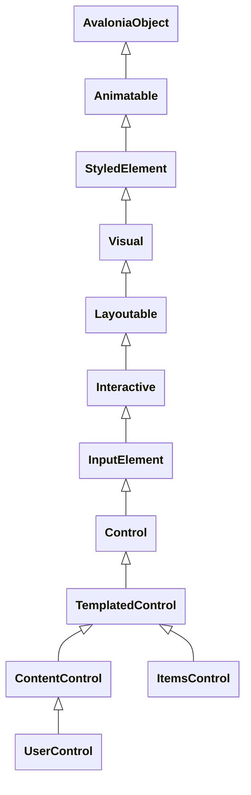

# Avalonia Types

## AvaloniaObject

All controls are derived from `AvaloniaObject` class.
There's some special and critical control base class you may encounter when using avalonia.
- `StyledElement`: a minimal useable control base which starts styling support, most of controls became applicable after this class
- `ContentControl`: control for presenting singular content
- `ItemsControl`: control for presenting multiple items
- `UserControl`: TODO
- `TemplatedControl`: TODO



## AvaloniaProperty

`AvaloniaProperty` is a base class for property definitions, it provides static utilities to generated a property instance which knows how to bind a value for certain kind of control.
- `AvaloniaProperty.Register`: define a `StyledProperty`
- `AvaloniaProperty.RegisterDirect`: define a `DirectProperty`
- `AvaloniaProperty.RegisterAttached`: define a `AttachedProperty`

> [!NOTE]
> You can query property definitions using `AvaloniaPropertyRegistry.Instance` singleton, it provides a bunch of method to find properties.

### Styled Property

`StyledProperty` is a property can be targeted by style selector attribute of a `Style`.
Since such property can be styled, it must be readable and writeable, so a complete property getter and setter are required.

1. A property definition(as an index for property value) using one of
    ```cs
    public static readonly StyledProperty<string?> TextProperty =
        AvaloniaProperty.Register<TextBlock, string?>(nameof(Text));
    ```
2. Delegate a normal property using `AvaloniaObject.GetValue` and `AvaloniaObject.SetValue`
    ```cs
    public string? Text {
        get => this.GetValue(TextProperty);
        set => this.SetValue(TextProperty, value);
    }
    ```

#### ValueStore for StyledProperty

`AvaloniaProperty` is in fact an index-like type for `AvaloniaObject`, `AvaloniaObject` uses property definition to query value stored in it.
Styling system takes **priorities** into account from both local and **inheritance** perspective, that's why `Avalonia.PropertyStore.ValueStore` was introduce to do the ordering.
Each `AvaloniaObject` has a private field of type `Avalonia.PropertyStore.ValueStore` for storing backing values of `StyledProperty`.
`GetValue` and `SetValue` are wrappers for manipulating the value store as you have seen how we implement property above.

```cs
public class AvaloniaObject : IAvaloniaObjectDebug, INotifyPropertyChanged {
    private readonly Avalonia.PropertyStore.ValueStore _values; // [!code highlight]

    public object? GetValue(AvaloniaProperty property) { /* ... */ }
    public T GetValue<T>(StyledProperty<T> property) { /* ... */ }
    public T GetValue<T>(DirectPropertyBase<T> property) { /* ... */ }
    public IDisposable? SetValue(AvaloniaProperty property, object? value, BindingPriority priority = BindingPriority.LocalValue) { /* ... */ }
    public IDisposable? SetValue<T>(StyledProperty<T> property, T value, BindingPriority priority = BindingPriority.LocalValue) { /* ... */ }
    public void SetValue<T>(DirectPropertyBase<T> property, T value) { /* ... */ }
}
```

### Direct Property

`DirectProperty` is a minimal property type registered for **plain data**, ideal for **indicators** of a control, such as `Button.IsPressed` or a **statistic** such as `ItemsControl.ItemCount` or even an **collection**.
Unlike `StyledProperty` which stores backing values in `ValueStore`, `DirectProperty` simply requires a dedicated **backing field** within the class.
`AvaloniaObject.SetAndRaise` will raise `AvaloniaObject.PropertyChanged` event **when the new value is different than the old.**

```cs
public static readonly DirectProperty<Button, bool> IsPressedProperty =
    AvaloniaProperty.RegisterDirect<Button, bool>(nameof(IsPressed), b => b.IsPressed);

private bool _isPressed = false; // standalone backing field // [!code highlight]

public bool IsPressed {
    get => _isPressed;
    private set => this.SetAndRaise(IsPressedProperty, ref _isPressed, value);
}
```

> [!IMPORTANT]
> It doesn't mean that a plain data can only be of `DirectProperty`, it can be a `StyledProperty` depending on its role, `Layoutable.HeightProperty` for example is a `StyledProperty`.

### Attached Property

`AttachedProperty` is a static property presentation that, it **does not require instance member as backing source**(like what `StyledProperty` and `DirectProperty` required) but two **conventional static getter/setter** methods to be invoked on runtime.

Besides `TOwner` and `TValue`, `AttachedProperty` has an extra type parameter

- `THost`: which kind of type the property can attach to

Static `Design` class is one of the great examples of attached property, what you have bind for `Design.DataContext` is exactly a property attached to your current control(`MainWindow` for example)
You would notice that `AttachedProperty` would require two **static** methods with conventional name, those methods would be invoked by runtime by their special name.
And the property value would be **still managed by `AvaloniaObject.GetValue` and `AvaloniaObject.SetValue`**, meaning that it has **same mechanism** as `StyledProperty`(the `ValueStore` was involved).

::: code-group


```cs [Design.DataContext]
public static readonly AttachedProperty<object> DataContextProperty = AvaloniaProperty
    .RegisterAttached<Control, object>("DataContext", typeof(Design));

public static void SetDataContext(Control host, object value) {
    host.SetValue(DataContextProperty, value); // [!code highlight]
}

public static object GetDataContext(Control host) {
    return host.GetValue(DataContextProperty); // [!code highlight]
}
```

```xml [Attach DataContext for Control]
<Window xmlns="https://github.com/avaloniaui"
        xmlns:x="http://schemas.microsoft.com/winfx/2006/xaml"
        xmlns:vm="using:MyAva.ViewModels"
        xmlns:d="http://schemas.microsoft.com/expression/blend/2008"
        xmlns:mc="http://schemas.openxmlformats.org/markup-compatibility/2006"
        mc:Ignorable="d" d:DesignWidth="800" d:DesignHeight="450"
        x:Class="MyAva.Views.MainWindow"
        x:DataType="vm:MainWindowViewModel"
        Icon="/Assets/avalonia-logo.ico"
        Title="MyAva">

    <Design.DataContext> <!-- [!code focus] -->
        <vm:MainWindowViewModel /> <!-- [!code focus] -->
    </Design.DataContext> <!-- [!code focus] -->
</Window>
```
:::

> [!IMPORTANT]
> Yes, XAML compiler would recognize the attached property and properly set the value at runtime.
> Even though it was written in an instance construction syntax.


### Reuse Property Definition

A `AvaloniaProperty` is specific to a nominal control by default(without variance), but you can reuse its definition by `prop.AddOwner` to register it to another control type.

```cs
public class MyCustomControl : Control {
    public static readonly StyledProperty<IBrush?> BackgroundProperty =
        Border.BackgroundProperty.AddOwner<MyCustomControl>(); // [!code highlight]
    public IBrush? Background {
        get => GetValue(BackgroundProperty);
        set => SetValue(BackgroundProperty, value);
    }
    public sealed override void Render(DrawingContext context) {
        if (Background != null) {
            var renderSize = Bounds.Size;
            context.FillRectangle(Background, new Rect(renderSize));
        }
        base.Render(context);
    }
}
```

### AvaloniaProperty is Index

You can use `AvaloniaProperty` as index on object initializer or controls itself, avalonia defined implicit operators for them.

```cs
var textBlock1 = new TextBlock();
var textBlock2 = new TextBlock {
    Foreground = Brushes.Red,
    MaxWidth = 200,
    [!TextBlock.TextProperty] = textBlock1[!TextBlock.TextProperty], // returns a binding definition // [!code highlight]
};
```

`AvaloniaObject` has the following indexers for retrieving property value or binding definition by `AvaloniaProperty` or its calculated `IndexerDescriptor`.

> [!NOTE]
> `!` unary operator you seen above returns a `IndexerDescriptor`

```cs
public object? this[AvaloniaProperty property] {
    get { return GetValue(property); }
    set { SetValue(property, value); }
}
public IBinding this[IndexerDescriptor binding] {
    get { return new IndexerBinding(this, binding.Property!, binding.Mode); }
    set { this.Bind(binding.Property!, value); }
}
```

## StyledElement.DataContext

`StyledElement.DataContext` is **the instance of view model** which allows you to access(or even mutate) the state of view model within a control(code-behind).
Avalonia **searches upward hierarchically** for `DataContext` property until top level element, meaning that controls can share context with children.

::: details definition

```cs
public class StyledElement : Animatable,
    IDataContextProvider,
    ILogical,
    IThemeVariantHost,
    IResourceHost2,
    IStyleHost,
    ISetLogicalParent,
    ISetInheritanceParent,
    ISupportInitialize,
    INamed,
    IAvaloniaListItemValidator<ILogical>,
#pragma warning disable CS0618 // Type or member is obsolete
    IStyleable
#pragma warning restore CS0618 // Type or member is obsolete
    {
        /** ... **/
        public static readonly StyledProperty<object?> DataContextProperty =
            AvaloniaProperty.Register<StyledElement, object?>(
                nameof(DataContext),
                defaultValue: null,
                inherits: true,
                defaultBindingMode: BindingMode.OneWay,
                validate: null,
                coerce: null,
                enableDataValidation: false,
                notifying: DataContextNotifying);

        public object? DataContext {
            get { return GetValue(DataContextProperty); }
            set { SetValue(DataContextProperty, value); }
        }
        /** ... **/
    }
```
:::

```cs
using Avalonia.Controls;
using MyApp.ViewModels;

namespace MyApp.Views;

public partial class MainWindow : Window {
    public MainWindow() {
        InitializeComponent();
        // getting property
        _ = (DataContext as MainWindowViewModel)?.Greeting; // [!code highlight]
        // adding event
       (DataContext as MainWindowViewModel)!.PropertyChanged += (_, _)=> {}; // [!code highlight]
    }
}
```

### Set DataContext Explicitly

Views beside `MainWindow`(which is the default window generated by avalonia project Template) needs explicit set for `DataContext`, because `MainWindow.DataContext` was assigned in `App.axaml.cs` so you don't need to worry about it.

::: details App.axaml.cs

```cs
public override void OnFrameworkInitializationCompleted() {
    if (ApplicationLifetime is IClassicDesktopStyleApplicationLifetime desktop) {
        DisableAvaloniaDataAnnotationValidation();
        desktop.MainWindow = new MainWindow {
            // default assignment for MainWindow // [!code highlight]
            DataContext = new MainWindowViewModel(), // [!code highlight]
        };
    }
    base.OnFrameworkInitializationCompleted();
}
```

:::

```cs
namespace MyApp.Views;

public partial class MyCustomView : UserControl {
    public MyCustomView() {
        InitializeComponent();
        this.DataContext = new MyViewModel(); // [!code highlight]
    }
}
```

### Design-Time Pseudo View

Sometimes you may like to fill some **mock data** in your previewer when writing your control.
You can create a dedicated view model class that inherits from a formal one, and assign mock values on construction.

```cs
public class MyDesignTimeViewModel: MyViewModel { // [!code highlight]
    public MyDesignTimeViewModel() {
        // properties are inherited from MyViewModel
        Name = "John Smith";
        Age = 28;
        Title = "Manager";
    }
}
```

Then you may specify the mock view model class for `Design.DataContext`.

```xml
<UserControl
    xmlns="https://github.com/avaloniaui"
    xmlns:x="http://schemas.microsoft.com/winfx/2006/xaml"
    xmlns:d="http://schemas.microsoft.com/expression/blend/2008"
    xmlns:mc="http://schemas.openxmlformats.org/markup-compatibility/2006"
    xmlns:vm="using:MyApp.ViewModels"
    mc:Ignorable="d" d:DesignWidth="400" d:DesignHeight="250"
    x:Class="MyApp.Views.MyCustomView"
    xmlns:vm="using:MyApp.ViewModels"
    x:DataType="vm:MyDesignTimeViewModel"> <!-- [!code focus] -->

   <Design.DataContext> <!-- [!code focus] -->
       <vm:MyDesignTimeViewModel/> <!-- [!code focus] -->
   </Design.DataContext> <!-- [!code focus] -->

</UserControl>
```

## Template Types & Properties

- Template Types:
    - `ITemplate<TParam, TControl>`: the base template interface that requires implementer to know how to `Build`(instantiate) the template.
        - `IDataTemplate`: inherits from `ITemplate<object?, Control?>`, requiring to know how to validate the `TParam` source using extra `Match` method.
            - `DataTemplate`: for defining template for specific data type
        - `IControlTemplate`: effectively `ITemplate<TemplatedControl, TemplateResult<Control>?>`
            - `ControlTemplate`: common template type for `TemplatedControl.TemplateProperty`

- Template Properties:
    - `Control.DataTemplates`: a direct collection of `IDataTemplate`(not a `AvaloniaProperty`)
        - provides a way to **present any type(such as a model) as a control**
    - `TemplatedControl.TemplateProperty`: how a control was presented, you may override this property for controls to alter its default appearance
    - `ContentControl.ContentTemplateProperty`: how `Content` was presented
    - `ItemsControl.ItemTemplateProperty`:


### IDataTemplate

The common builtin presenter for displaying objects other than `AvaloniaObject` with certain format, implements `IDataTemplate`.
A typical usage of `IDataTemplate` is `ViewLocator` which determines what kind of control can
**Yes, controls are not specially treated by XAML compiler,** they were only allowed when you specify `.DataTemplates` for `Application` so that the application could load controls by the context object at runtime(**using reflection**).

> [!NOTE]
> If one were to compile ahead-of-time which could not use reflection, should use `CompiledBinding` markup and `DataTemplate.DataType` to inform XAML compiler explicitly.

```xml
<Application.DataTemplates>
  <DataTemplate DataType="{x:Type local:Person}"> <!-- [!code focus] -->
    <TextBlock>First Name:</TextBlock>
    <TextBlock Text="{Binding FirstName}"/>
    <TextBlock>Last Name:</TextBlock>
    <TextBlock Text="{Binding LastName}"/>
  </DataTemplate>
</Application.DataTemplates>
```

- `Match(obj)`: determine whether current `DataContext` could embody using the given template.
- `Build(obj)`: instantiate the template using current `DataContext`

::: code-group
```cs [ViewLocator]
public class ViewLocator : IDataTemplate {
    public Control? Build(object? datacontext) {
        if (datacontext is null)
            return null;

        var name = datacontext.GetType().FullName!.Replace("ViewModel", "View", StringComparison.Ordinal);
        var type = Type.GetType(name);

        if (type != null) {
            return (Control)Activator.CreateInstance(type)!;
        }

        return new TextBlock { Text = "Not Found: " + name };
    }

    public bool Match(object? datacontext) {
        return datacontext is ViewModelBase;
    }
}
```
```xml [App.axaml]
<Application xmlns="https://github.com/avaloniaui"
             xmlns:x="http://schemas.microsoft.com/winfx/2006/xaml"
             x:Class="MyAva.App"
             xmlns:local="using:MyAva"
             RequestedThemeVariant="Default">
             <!-- "Default" ThemeVariant follows system theme variant. "Dark" or "Light" are other available options. -->

    <Application.DataTemplates> <!-- [!code focus] -->
        <local:ViewLocator/> <!-- [!code focus] -->
    </Application.DataTemplates> <!-- [!code focus] -->

    <Application.Styles>
        <FluentTheme />
    </Application.Styles>
</Application>
```
:::


### ContentControl.ContentTemplate

`ContentControl.ContentTemplate` is of type `IDataTemplate` that is commonly overridden by `DataTemplate`, the default **presentation of custom data formatting** type.
The whole point of `DataTemplate` is to provide a way to format `ContentProperty` using given format.

<!-- TODO: add example -->

### ItemsControl.ItemTemplate

Similar to `ContentControl.ContentTemplate` but for presenting items

## ControlTemplate

A common placeholder type to present how to re-structure a control's template looking(which you don't have access to modify the control's source definition).
This is typically used to override `TemplatedControl.Template` and with `TemplateBinding` markup extension to read context from containing control.

```xml
<Setter Property="Template">
  <ControlTemplate> <!-- [!code highlight] -->
    <TextBlock Text="Templated Control" /> <!-- [!code highlight] -->
  </ControlTemplate> <!-- [!code highlight] -->
</Setter>
```

## Presenter Controls

Presenter controls are control scaffold for representing certain content as a **wrapper** itself, so that it can bind **any source** of content from context within it.

### ContentPresenter

`ContentPresenter` is a type of placeholder for singular content. It's a lightweight element whose sole purpose is to **define a binding declaration** for displaying the content of a `ContentControl`
So it's typically seen in declaration of `TemplatedControl.Template` and using with `TemplateBinding` markup extension to read context from containing control.

```xml
<ToggleButton.Template>
  <ControlTemplate>
    <Grid ColumnDefinitions="*,Auto">
     <ContentPresenter <!-- [!code highlight] -->
       Grid.Column="0" <!-- [!code highlight] -->
       Content="{TemplateBinding Content}"> <!-- [!code ++] -->
     </ContentPresenter> <!-- [!code highlight] -->
   </Grid>
  </ControlTemplate>
</ToggleButton.Template>
```

### ItemsPresenter

A place holder type presenting items specifically with `TemplateBinding`.

Similar to `ContentControl.ContentTemplate` but for presenting items

