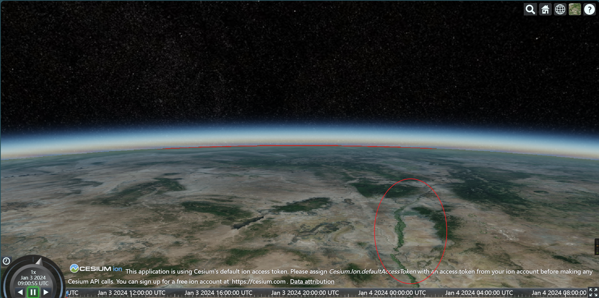
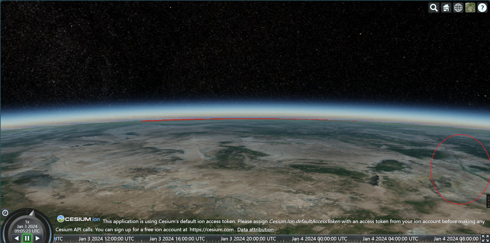
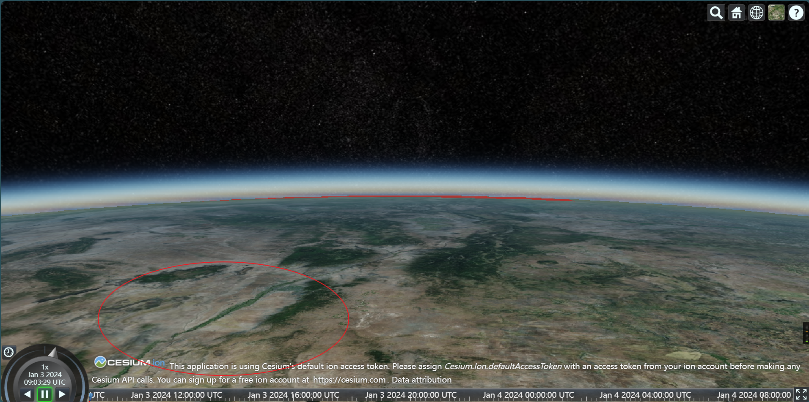
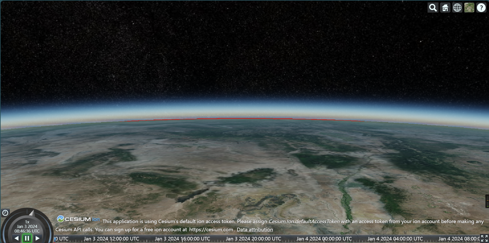
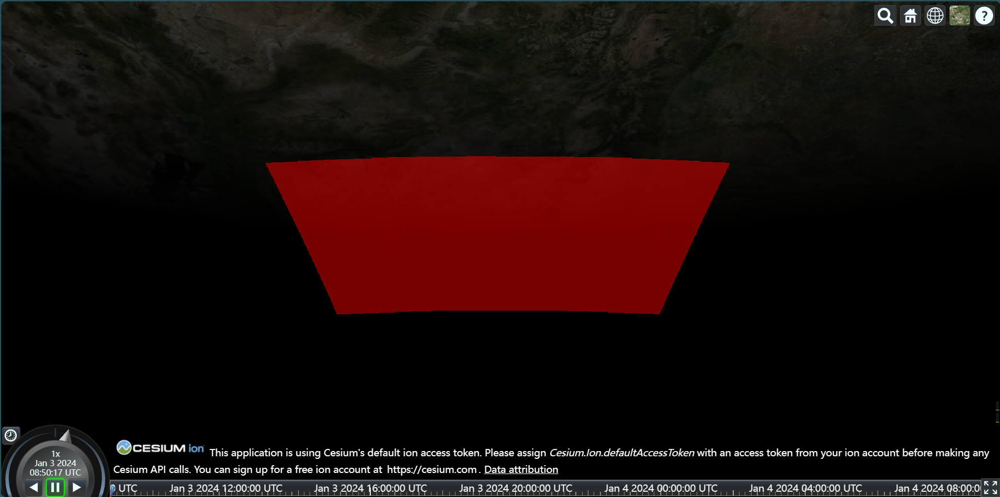
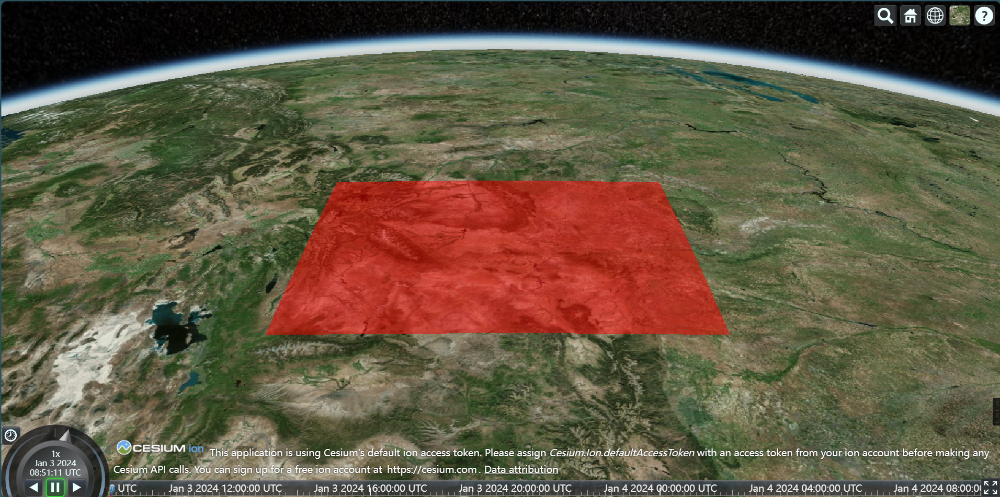

# Working with globe

## Navigate to somewhere on earth

```vue
<script setup lang="ts">
    import { Cartesian3, Viewer } from 'cesium';
    import 'cesium/Build/Cesium/Widgets/widgets.css';
    import { onMounted, ref, shallowRef } from 'vue';
    const globe = ref<Element | null>(null);
    const viewer = shallowRef<Viewer | null>(null);
    onMounted(async () => {
        viewer.value = new Viewer(globe.value as Element);
        viewer.value.camera.flyTo({
            destination: Cartesian3.fromDegrees(-104.9965, 39.74248, 4000) // 4km high from the ellipsoid.
        });
    });
</script>
```

## Camera control

### `zoomTo()` vs `flyTo()`

These two method are both asynchronous

- `zoomTo()` navigates to object without animation.
- `flyTo()` navigates to object with default animation.

:::code-group

```ts[flyTo()]
export class Viewer {
    // ...
    flyTo(
        target:
            | Entity
            | Entity[]
            | EntityCollection
            | DataSource
            | ImageryLayer
            | Cesium3DTileset
            | TimeDynamicPointCloud
            | Promise<
                  | Entity
                  | Entity[]
                  | EntityCollection
                  | DataSource
                  | ImageryLayer
                  | Cesium3DTileset
                  | TimeDynamicPointCloud
                  | VoxelPrimitive
              >,
        options?: {
            duration?: number;
            maximumHeight?: number;
            offset?: HeadingPitchRange;
        }
    ): Promise<boolean>;
}

```

```ts[zoomTo()]
export class Viewer {
    // ...
    zoomTo(
        target:
            | Entity
            | Entity[]
            | EntityCollection
            | DataSource
            | ImageryLayer
            | Cesium3DTileset
            | TimeDynamicPointCloud
            | Promise<
                  | Entity
                  | Entity[]
                  | EntityCollection
                  | DataSource
                  | ImageryLayer
                  | Cesium3DTileset
                  | TimeDynamicPointCloud
                  | VoxelPrimitive
              >,
        offset?: HeadingPitchRange
    ): Promise<boolean>;
}

```

:::

### `HeadingPitchRange`

By default, the camera is oriented north and is looking down from a 45 degree angle. Customize this by passing in a `HeadingPitchRange`.

:::code-group

```ts[definition]
export class HeadingPitchRange {
    constructor(heading?: number, pitch?: number, range?: number);
    /**
     * Heading is the rotation from the local north direction where a positive angle is increasing eastward.
     */
    heading: number;
    /**
     * Pitch is the rotation from the local xy-plane. Positive pitch angles
     * are above the plane. Negative pitch angles are below the plane.
     */
    pitch: number;
    /**
     * Range is the distance from the center of the local frame.
     */
    range: number;
    /**
     * Duplicates a HeadingPitchRange instance.
     * @param hpr - The HeadingPitchRange to duplicate.
     * @param [result] - The object onto which to store the result.
     * @returns The modified result parameter or a new HeadingPitchRange instance if one was not provided. (Returns undefined if hpr is undefined)
     */
    static clone(hpr: HeadingPitchRange, result?: HeadingPitchRange): HeadingPitchRange;
}
```

```ts[sample]
onMounted(async () => {
    viewer.value = new Cesium.Viewer(globe.value as Element);
    const entity = viewer.value.entities.add({
        polygon: {
            hierarchy: Cesium.Cartesian3.fromDegreesArray([
                -109.080842, 45.002073, -105.91517, 45.002073, -104.058488, 44.996596,
                -104.053011, 43.002989, -104.053011, 41.003906, -105.728954, 40.998429,
                -107.919731, 41.003906, -109.04798, 40.998429, -111.047063, 40.998429,
                -111.047063, 42.000709, -111.047063, 44.476286, -111.05254, 45.002073
            ]),
            height: 0,
            material: Cesium.Color.RED.withAlpha(0.5),
            outlineColor: Cesium.Color.BLACK
        }
    });
    viewer.value.zoomTo(
        entity,
        new Cesium.HeadingPitchRange(Cesium.Math.toRadians(0), Cesium.Math.toRadians(0))
    );
});
```

:::

#### Heading

Heading is the rotation from the local north direction where a positive angle is increasing eastward.

1. When zero
    - Camera in the same plane
    
2. When positive
    - Camera under the ground.(heading=`Cesium.Math.toRadians(10)`)
    
3. When negative
    - Camera above the ground.((heading=`Cesium.Math.toRadians(-10)`))
    

#### Pitch

Pitch is the rotation from the local xy-plane. Positive pitch angles are above the plane. Negative pitch angles are below the plane.

1. When zero
    - Camera in the same plane
    
2. When positive
    - Camera under the ground.
    
3. When negative
    - Camera above the ground.
    

## Add OpenStreetMap Building

Cesium OSM Buildings is a **global** base layer with over 350 million buildings derived from OpenStreetMap data.

```vue
<script setup lang="ts">
    import { Cartesian3, Viewer, createOsmBuildingsAsync } from 'cesium';
    import 'cesium/Build/Cesium/Widgets/widgets.css';
    import { onMounted, ref, shallowRef } from 'vue';
    const globe = ref<Element | null>(null);
    const viewer = shallowRef<Viewer | null>(null);
    onMounted(async () => {
        viewer.value = new Viewer(globe.value as Element);
        viewer.value.camera.flyTo({
            destination: Cartesian3.fromDegrees(-104.9965, 39.74248, 4000)
        });
        const osm = await createOsmBuildingsAsync();
        viewer.value!.scene.primitives.add(osm);
    });
</script>
```
