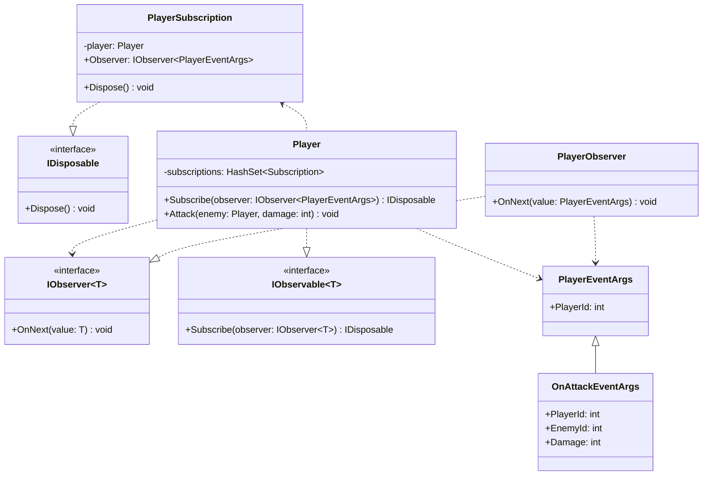

# Observer

## Motivation

- To be informed when status changed
- To be informed when certain things happened.
- Listen to events and get notified when they occurs

.NET has following builtin types to perform observer pattern.

- `INotifyPropertyChanged`
- `INotifyPropertyChanging`
- `IObservable<T>`
- `IObserver<T>`
- `ObervableCollection<T>`
- `BindingList<T>`

> [!NOTE]
> Observer is the object to be informed when event occurs, informed by passing event args.
> Observable is the object passes the event args when performing something.

## Builtin Event

C# has builtin event support. Use `+=` to subscribe a method.

> [!NOTE]
> Event handler is the Observer
> `Player` is the Observable

```cs
Player player = new() { Id = 1 };
Player enemy = new() { Id = 2 };

player.OnHurt += (object? sender, PlayerOnHurtArgs args) => // event handler method is the Observer// [!code highlight]
    Console.WriteLine($"Player {(sender as Player)?.Id ?? -1} get hurt by damage {args.Damage} from player {args.Id}"); // [!code highlight]

player.GetHurt(1, enemy);

class Player {
    public int Id { get; init; }
    public int Health { get; private set; } = 100;
    public event EventHandler<PlayerOnHurtArgs>? OnHurt;
    public void GetHurt(int damage, Player another) {
        Health -= damage;
        OnHurt?.Invoke(this, new(damage, another.Id)); // [!code highlight]
    }
}

record PlayerOnHurtArgs(int Damage, int Id);
```

## Weak Event

When a method of an instance was added to an event, the containing object of the method will never be collected by GC.

```cs
Player player = new() { Id = 1 };
Player? enemy = new() { Id = 2 };

player.OnHurt += enemy.OnHurtHandler; // subscribes a handler from another instance // [!code highlight]
WeakReference<Player> enemyRef = new(enemy);
enemy = null;
GC.Collect(); // should enemy be collected? // [!code highlight]
Console.WriteLine($"enemy is {(enemyRef.TryGetTarget(out _) ? "alive" : "collected")}"); // <- enemy is alive // [!code highlight]

class Player {
    public int Id { get; init; }
    public int Health { get; private set; } = 100;
    public event EventHandler<PlayerOnHurtArgs>? OnHurt;
    public void GetHurt(int damage, Player enemy) {
        Health -= damage;
        OnHurt?.Invoke(this, new(damage, enemy.Id));
    }
    public void OnHurtHandler(object? sender, PlayerOnHurtArgs args) {
        Console.WriteLine($"Player {(sender as Player)?.Id ?? -1} get hurt by damage {args.Damage} from player {args.Id}"); // [!code ++]
    }
}

record PlayerOnHurtArgs(int Damage, int Id);
```

That's why weak event pattern matters.
```cs
Player player = new() { Id = 1 };
Player? enemy = new() { Id = 2 };

player.OnHurt += enemy.OnHurtHandler; // subscribes a handler from another instance // [!code --]
WeakEventManager<Player, PlayerOnHurtArgs>.AddHandler(player. "OnHurt", enemy.OnHurtHandler) // [!code ++]
WeakReference<Player> enemyRef = new(enemy);
enemy = null;
GC.Collect(); // should enemy be collected? // [!code highlight]
Console.WriteLine($"enemy is {(enemyRef.TryGetTarget(out _) ? "alive" : "collected")}"); // <- enemy is collected // [!code highlight]

class Player {
    public int Id { get; init; }
    public int Health { get; private set; } = 100;
    public event EventHandler<PlayerOnHurtArgs>? OnHurt;
    public void GetHurt(int damage, Player enemy) {
        Health -= damage;
        OnHurt?.Invoke(this, new(damage, enemy.Id));
    }
    public void OnHurtHandler(object? sender, PlayerOnHurtArgs args) {
        Console.WriteLine($"Player {(sender as Player)?.Id ?? -1} get hurt by damage {args.Damage} from player {args.Id}"); // [!code ++]
    }
}

record PlayerOnHurtArgs(int Damage, int Id);
```
> [!WARNING]
> `WeakEventManager` is not available in .NET Core

## Observer & Observable

The major downside of event in C# is **event leak**, which happens when event handlers remain subscribed and prevent objects from being garbage collected, leading to memory leaks.

.NET has builtin types to implement the same event mechanism with `System.IObserver<T>` and `System.IObservable<T>`



**Observable and Observer do not know each other, the mediator is certain `EventArgs`. Observer handles notifications by different kinds of `EventArgs`.**

- Observable: knows how to add and remove subscriptions(Observers)
    - each subscription should be of `IDisposable`, so you need to create a dedicated type to present it.
        - `IDisposable.Dispose` acts like `-=`
    - `IObservable<T>.Subscribe` acts like `+=`
- Observer
    - knows how to handle messages from observable(`IObserver<TEventArgs>.OnNext`)
    - knows how to handle exception from observable(`IObserver<TEventArgs>.OnError`)
    - knows how to perform a post action on complete(`IObserver<TEventArgs>.OnCompleted`)

```cs
Player player = new() { Id = 1 };
Player? enemy = new() { Id = 2 };
using var _ = player.Subscribe(new PlayerObserver()); // add one observer // [!code highlight]
player.Attack(enemy, 100); // Attack would notify subscribed observers, see context below // [!code highlight]

class Player : IObservable<PlayerEventArgs> {
    public int Id { get; init; }
    public int Health { get; private set; } = 100;
    private readonly HashSet<Subscription> subscriptions = []; // events as collections // [!code highlight]

    // subscribes an event just like `+=` when using standard clr event // [!code highlight]
    public IDisposable Subscribe(IObserver<PlayerEventArgs> observer) { // [!code highlight]
        var subscription = new Subscription(this, observer); // [!code highlight]
        subscriptions.Add(subscription); // [!code highlight]
        return subscription; // [!code highlight]
    } // [!code highlight]

    public void Attack(Player enemy, int damage) {
        // ...
        foreach (var sub in subscriptions) { // [!code highlight]
            sub.Observer.OnNext(new OnAttackEventArgs { EnemyId = enemy.Id, Damage = damage, PlayerId = Id }); // [!code highlight]
        } // [!code highlight]
    }
    // a subscription should know which one is being subscribed and who is the observer. // [!code highlight]
    // observer take a `PlayerEventArgs` which is a base EventArgs, allowing different type of subscription to be inside `subscriptions` // [!code highlight]
    private class Subscription(Player player, IObserver<PlayerEventArgs> observer) : IDisposable {
        private readonly Player player = player;
        public IObserver<PlayerEventArgs> Observer { get; } = observer;
        public void Dispose() { // [!code highlight]
            player.subscriptions.Remove(this); // [!code highlight]
        } // [!code highlight]
    }
}

class PlayerEventArgs {
    public int PlayerId { get; set; }
}
class OnAttackEventArgs : PlayerEventArgs {
    public int EnemyId { get; set; }
    public int Damage { get; set; }
}
class PlayerObserver : IObserver<PlayerEventArgs> {
    public void OnCompleted() { }

    public void OnError(Exception error) { }

    public void OnNext(PlayerEventArgs value) {
        if (value is OnAttackEventArgs args) {
            Console.WriteLine($"Enemy id: {args.EnemyId} was attacked by player id: {args.PlayerId} with damage {args.Damage}");
        }
        // ...
    }
}
```


## Observable Collection

`BindingList<T>` is a collection type with builtin event to tracked on collection manipulations.

```cs
using System.ComponentModel;

new Weather().Measure(); // [!code highlight]

class Weather {
    public BindingList<float> Tempretures { get; } = [];
    public Weather() {
        // BindingList has a builtin event on manipulation
        Tempretures.ListChanged += (sender, args) => // [!code highlight]
        { // [!code highlight]
            if (args.ListChangedType == ListChangedType.ItemAdded) { // [!code highlight]
                var newtempreture = (sender as BindingList<float>)?[args.NewIndex]; // [!code highlight]
                Console.WriteLine($"New tempreture {newtempreture} degree has been added."); // [!code highlight]
            } // [!code highlight]
        }; // [!code highlight]
    }
    public void Measure() {
        Tempretures.Add(Random.Shared.NextSingle() * 100);
    }
}
```

> [!WARNING]
> `BindingList<T>` can only track manipulations, can't track on status.
> For those purposes, you should add custom events.


## Property Observer

Use `INotifyPropertyChanged` for watching properties.
**`INotifyPropertyChanged` implies the object implementing this interface should have a ability to be informed when certain property changed.**
The event handler generated takes `PropertyChangedEventArgs` which has only a property named as `PropertyName`.

```cs
using System.ComponentModel;

Player player = new() { Id = 1 };
Player? enemy = new() { Id = 2 };
player.Attack(enemy, 100); // [!code highlight]

class Player : INotifyPropertyChanged {
    public int Id { get; init; }
    public int Health { get; private set; } = 100;

    public event PropertyChangedEventHandler? PropertyChanged; // [!code highlight]

    public Player() {
        PropertyChanged += (sender, args) => {
            Console.WriteLine($"Property `{args.PropertyName}` of {(sender as Player)?.Id ?? -1} changed!");
        };
    }
    public void Attack(Player enemy, int damage) {
        enemy.Health -= damage;
        Console.WriteLine($"enemy {Id} been attacked by player {enemy.Id} with damage {damage}");
        PropertyChanged?.Invoke(this, new PropertyChangedEventArgs(nameof(Health)));
    }
}
```

### Bidirectional Observer

A bidirectional observer means two objects subscribe each other, will get notification on no matter which side.
So, a common approach is implementing `INotifyPropertyChanged` and append event handlers for both.

```cs
using System.ComponentModel;
using System.Runtime.CompilerServices;

var init = "Hello"; // [!code highlight]
View view = new() { InnerText = init }; // [!code highlight]
TextBlock textBlock = new() { Text = init }; // [!code highlight]
// [!code highlight]
view.PropertyChanged += (sender, args) => { // [!code highlight]
    if (args.PropertyName == nameof(View.InnerText)) { // [!code highlight]
        Console.WriteLine($"Property {typeof(View).Name}.{nameof(View.InnerText)} has changed."); // [!code highlight]
        textBlock.Text = view.InnerText; // also updates for another side // [!code highlight]
    } // [!code highlight]
}; // [!code highlight]
// [!code highlight]
textBlock.PropertyChanged += (sender, args) => { // [!code highlight]
    if (args.PropertyName == nameof(TextBlock.Text)) { // [!code highlight]
        Console.WriteLine($"Property {typeof(TextBlock).Name}.{nameof(TextBlock.Text)} has changed."); // [!code highlight]
        view.InnerText = textBlock.Text; // also updates for another side // [!code highlight]
    } // [!code highlight]
}; // [!code highlight]

view.InnerText = "World"; // [!code highlight]
// Property View.InnerText has changed. // [!code highlight]
// Property TextBlock.Text has changed. // [!code highlight]
Console.WriteLine(view.InnerText); // <- World // [!code highlight]
Console.WriteLine(textBlock.Text); // <- World // [!code highlight]

class TextBlock : INotifyPropertyChanged {
    private string? text;

    public string? Text {
        get => text;
        set {
            if (value == text) return; // [!code highlight]
            text = value;
            OnPropertyChanged(); // [!code highlight]
        }
    }

    public event PropertyChangedEventHandler? PropertyChanged;

    protected virtual void OnPropertyChanged([CallerMemberName] string? propertyName = null) {
        PropertyChanged?.Invoke(this, new PropertyChangedEventArgs(propertyName));
    }
}
class View : INotifyPropertyChanged {
    private string? innerText;

    public string? InnerText {
        get => innerText;
        set {
            if (value == innerText) return; // [!code highlight]
            innerText = value;
            OnPropertyChanged(); // [!code highlight]
        }
    }

    public event PropertyChangedEventHandler? PropertyChanged;

    protected virtual void OnPropertyChanged([CallerMemberName] string? propertyName = null) {
        PropertyChanged?.Invoke(this, new PropertyChangedEventArgs(propertyName));
    }
}
```

> [!NOTE]
> An interesting part is, bidirectional observer above does not cause stack overflow.
> simply because a guardian `if(value == prop) return` is inside setter.

### Bidirectional Binding

Previous example shows a very tedious implementation for bidirectional observer, we don't really want to hard code everything for each pair of object we have.
So, a custom generic class for performing the mechanism if required.

```cs
using System.ComponentModel;
using System.Linq.Expressions;
using System.Reflection;
using System.Runtime.CompilerServices;

var init = "Hello";
View view = new() { InnerText = init };
TextBlock textBlock = new() { Text = init };

var _ = new BidirectionalBinding<View, TextBlock>(
    view,
    v => v.InnerText, // selects which property to track // [!code highlight]
    textBlock,
    t => t.Text // [!code highlight]
);

view.InnerText = "World"; // [!code highlight]
Console.WriteLine(view.InnerText); // <- World // [!code highlight]
Console.WriteLine(textBlock.Text); // <- World // [!code highlight]

class BidirectionalBinding<TFirst, TSecond>
    where TFirst : INotifyPropertyChanged // both should be `INotifyPropertyChanged` // [!code highlight]
    where TSecond : INotifyPropertyChanged
{
    public BidirectionalBinding(
        TFirst first,
        Expression<Func<TFirst, object?>> firstSelector,
        TSecond second,
        Expression<Func<TSecond, object?>> secondSelector)
    {
        if (firstSelector.Body is MemberExpression firExpr && secondSelector.Body is MemberExpression secExpr) {
            if (firExpr.Member is PropertyInfo firProp && secExpr.Member is PropertyInfo secProp) {
                first.PropertyChanged += (sender, args) => secProp.SetValue(second, firProp.GetValue(first)); // [!code highlight]
                second.PropertyChanged += (sender, args) => firProp.SetValue(first, secProp.GetValue(second)); // [!code highlight]
            }
        }
    }
}
```

> [!NOTE]
> `BidirectionalBinding` should actually be a `IDisposable`, but I failed to find a way to deleted the event handlers.

## Property Dependencies (WIP)

On problem of property observer is, multiple property tracking is possible unless they have dependencies among.

Given a example of a property for conditional status `IsDying` which is dependent on  property `Health`.

Once `Health` changed, `IsDying` might changed too, but would need a extra check to make sure it doesn't notify on each change of `Health`.
**But this will explode when you have many many dependent properties.**

```cs
using System.ComponentModel;
using System.Runtime.CompilerServices;

Player p = new();
p.Health -= 99; // [!code highlight]
// Property Health changed
// Property IsDying changed

class Player : INotifyPropertyChanged {
    private int health = 100;

    public int Health {
        get => health;
        set {
            if (value == health) return;
            var isDying = IsDying; // [!code highlight]
            health = value;
            OnPropertyChanged();
            if (isDying != IsDying) // [!code highlight]
                OnPropertyChanged(nameof(IsDying)); // [!code highlight]
        }
    }

    public bool IsDying => Health < 5; // [!code highlight]

    public Player() {
        PropertyChanged += (sender, args) =>
            Console.WriteLine($"Property {args.PropertyName} changed.");
    }

    public event PropertyChangedEventHandler? PropertyChanged;

    protected virtual void OnPropertyChanged([CallerMemberName] string? propertyName = null) {
        PropertyChanged?.Invoke(this, new(propertyName));
    }
}
```

We'll have to use a base class to handle the default behaviors.
Each property might have multiple dependencies and each dependency should be unique since they're inside the same class.
So a map as `Dictionary<string, HashSet<string>>` appears here and the `OnPropertyChanged` should walk each property recursively.

```cs
abstract class PropertyNotificationSupport : INotifyPropertyChanged {
    private readonly Dictionary<string, HashSet<string>> _depedendcyMap = []; // stores property name and its dependent properties. // [!code highlight]
    public event PropertyChangedEventHandler? PropertyChanged;

    protected virtual void OnPropertyChanged([CallerMemberName] string? propertyName = null) {
        PropertyChanged?.Invoke(this, new(propertyName));
        foreach (var prop in _depedendcyMap.Keys) {
            // for props relied on the coming property
            // notify them recursively
            if (_depedendcyMap[propertyName].Contains(prop))
                OnPropertyChanged(prop); // recursive call on other property dependencies // [!code highlight]
        }
    }
}
```

Yet another target is not only tracking the single property name but also sending with which property change causes the change of another property.
Which means the literal property dependency graph.

The solution is using `Expression`, to assign both evaluation logic and name of the property with one shot. We should have a method inside base class to do that.

```cs
private readonly Func<bool> _isDying; // [!code highlight]
public bool IsDying => _isDying();
public Player() {
    // implement `Property` method in the base class.
    IsDying = Property(nameof(IsDying), () => Health < 5); // [!code highlight]
}
```
