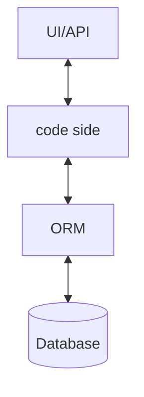

# Introduction

In this chapter, we'll discuss four approaches to do testing.

- Test database
- Database in memory
- Fake database
- Use Repository pattern



## Project setup

```sh
dotnet new xunit -n <test_project_name> && \
cd <test_project_name> && \
dotnet add reference <test_project_name>/<test_project_name>.csproj && \
dotnet add package Microsoft.EntityFrameworkCore.Sqlite && \
dotnet add package MockQueryable.NSubstitute && \
dotnet restore
```
