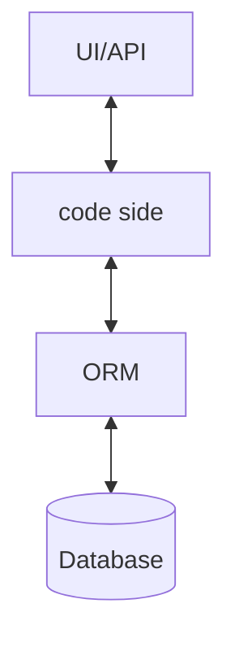

# Test Database

## Pros & Cons

- Pros:
    - Same code logical to be used.
    - No mocking involved since we use the copy of the database.
    - Large amount of records to test.

- Cons:
    - Trivial setup/cleanup before/after tests
    - Concurrency, tests may affect other running tasks.
    - Can be slow when too many tests and data were involved.

