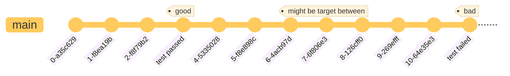

# Git History & Reset

## Commit Log

- `git log`: commit logs that generated by traversing commit graph for each time you inspect it.

### Commit History Query

- `-<n>`: limits count of commit logs
- `--skip=<n>`: skip count
- `--grep=<pattern>`: return commits that match the pattern
- ..., see: `git help log` in *Commit Limiting* section

### History Exclusion

Use `^` to exclude commits from certain points, such as `git log ^main foo` to exclude commits from `main` but keep commits from `foo`.

Example: show commits within branch `pwsh_es` but not in `master`:
```console
$ git log ^master pwsh_es
* e8284ebb96d8 (origin/pwsh_es, pwsh_es) maintainers: add sharpchen
* c0c964d8ae68 powershell-editor-services: init at 4.1.0

$ git log master..pwsh_es
* e8284ebb96d8 (origin/pwsh_es, pwsh_es) maintainers: add sharpchen
* c0c964d8ae68 powershell-editor-services: init at 4.1.0
```

## Reflog

- `git reflog`: local operation logs which is more detailed but limited to local repository.
    - **dynamic pointers** such as `HEAD` and branches have their dedicated reflog on their own.
    - stores at `.git/logs/**`

> [!NOTE]
> `git reflog` is generally faster to print than `git log` on a **large repository**, because reflog is a literal text file stored at `.git/logs/`
> While `git log` has to traverse the large graph dynamically which would take a longer time to execute.

## Bisect

`git bisect` is a subcommand to search a target commit by testing *good* or *bad*, which delineated a range of the possible target commit, and you keep half-cut the range by testing *good* or *bad* until you met the final commit that's *bad*.

Assuming you have a error one testing introduced at some point but you can't figure out which commit introduced it, but you are dare to stride back to a commit that does not error which can be a start point of *good*.
Correspondingly, the current commit you're on can be the start point of *bad*, that is, the error was introduced between *good* and *bad*.



1. `git bisect start`: enter *bisect* stage
2. select a initial range
    - `git bisect bad`: select one commit that you consider *bad*, defaults to `HEAD`
    - `git bisect good <commit>`: select a *good* starting point, it's the commit you dare to stride back.
3. git will locate you at the *middle* commit of the range, run test again
    - if test failed, `git bisect bad`
    - if succeeded, `git bisect good`
    - git shrinks the search range each time you mark current commit as *bad* or *good*
4. keep shrinking the range until git told you the final commit clamped
    - the final commit returned is the commit introduced the *bad*
5. `git bisect reset`: exit bisect stage

> [!TIP]
> *good* and *bad* are not only terms can be used in `git bisect`, *old* and *new* are available when you just need to find **the first commit introduced a change** instead of an error.
> But they're identical pair, just choose one for better semantic at your use case.
> See: *Alternate terms* section in `git help bisect`

### Auto Bisect

Repeating clamping each time is a bad experience, so you'd better use `git bisect run <cmd>` to run.

>Note that the script (my_script in the above example) **should exit with code 0 if the current source code is good/old,
>and exit with a code between 1 and 127 (inclusive), except 125, if the current source code is bad/new.**
>
>Any other exit code will abort the bisect process. It should be noted that a program that terminates via `exit(-1)` leaves
>`$? = 255`, (see the `exit(3)` manual page), as the value is chopped with `& 0377`.

> [!IMPORTANT]
> You should make sure the command for `git bisect run <cmd>` exits itself otherwise the operation wouldn't be automatic.
> See: *Bisect run* section in `git help bisect`


## Revert

Once you find a change causing an error using `git bisect` or any method, you might be like to *revert* **that commit of changes**.
`git revert <commit>` is for trying to cancel the change of that commit, and simultaneously generate a *revert commit*.

When any conflict exists, you just handle it like *merge* or *rebase*, and `git revert --continue`

## Reset

- `--mixed`: the default action on reset, leaves all tracked changes since the *commit* reset to as *upstaged* state
- `--soft`: leaves all tracked changes along in a *staged* state.
- `--hard`: discard all tracked changes since the *commit* reset to, they're gone in the wild unless you get it back with *reflog*
- see: `git help reset` for complete list of reset modes.

> [!NOTE]
> The equivalence of `git reset --hard <commit>` is like
>```console
>$ git branch
>  main
>* dev
>
>$ git checkout <commit> # detach from a branch
>
>$ git branch -D dev # stop tracking original branch(aka deleting a branch)
>$ git branch -b dev # attach current commit checked out as new top of the branch(aka creating a branch)
>$ echo 'reset done'
>```
